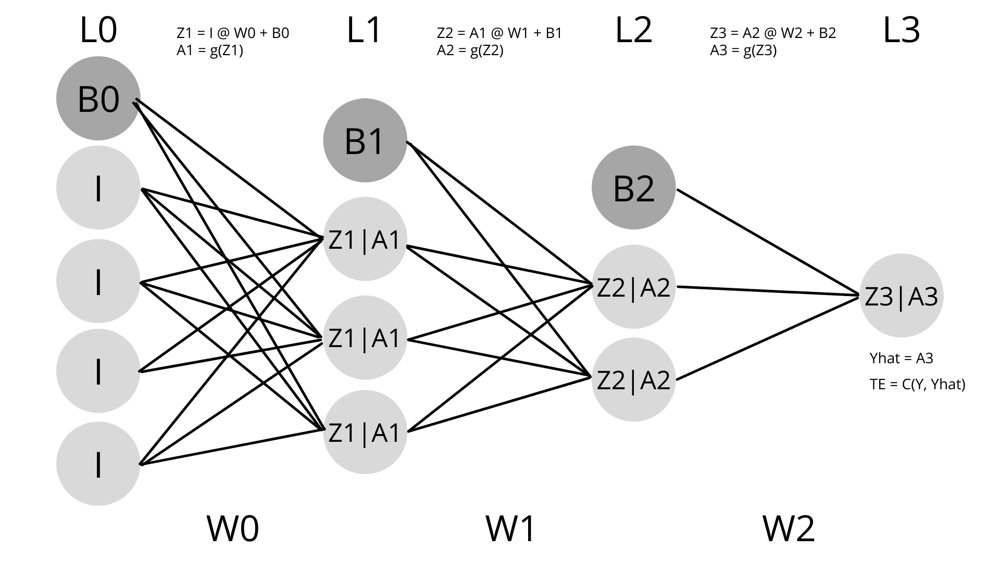
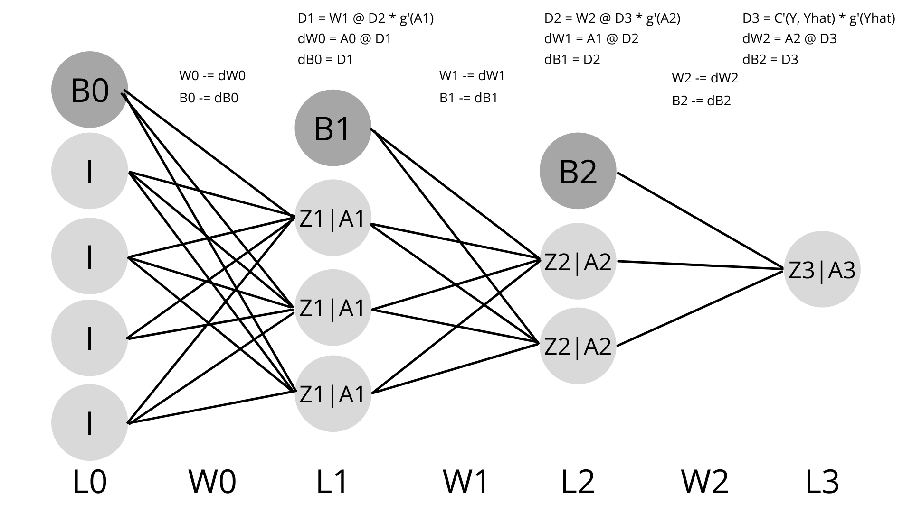

# neural-networks and supervised learning
## Table of contents
- [Before reading](#Before-Reading)
- [Introduction](#INTRODUCTION)
- [Neural network parameters](#NEURAL-NETWORK-PARAMETERS)
  - [Layers & nodes](#LAYERS--NODES)
  - [Gradient descend](#GRADIENT-DESCEND)
    - [Stochastic](#Stochastic)
    - [Batch](#Batch)
    - [Mini-batch](#Mini-batch)
  - [Learning rate](#LEARNING-RATE)
  - [Activation-function](#activation-function)
  - [Cost function](#COST-FUNCTION)
  - [Weight & bias init](#Weight--bias-init)
  - [Regularization](#Regularization)
    - [Dropout method](#DROPOUT-METHOD)
    - [L2-regularization](#L2-regularization)
    - [Early stopping](#Early-stopping)
  - [Optimization methods](#OPTIMIZATION-METHODS)
    - [Momentum and nesterov methods](#MOMENTUM-AND-NESTEROV-METHODS)
    - [Adagrad, adadelta, Rmsprop, adam, nadam](#adagrad-adadelta-rmsprop-adam-nadam)
    - [Parallelizing-SGD](#PARALLELIZING-SGD)
    - [Gradient-nose](#gradient-nose)
- [Math implementation](#math-implementation)
  - [Forward propagation](#forward-propagation)
  - [Back propagation](#back-propagation)
- [Data preparation & visualization](#DATA-PREPARATION--VISUALIZATION)
  - [Non-numeric to numeric data](#non-numeric-to-numeric-data)
  - [Expected/Y data](#expectedy-data)
  - [Normalization](#Normalization)
  - [Data splitting](#data-splitting)
  - [Describe](#Describe)
  - [Pairplot](#Pairplot)
- [Debugging a learning algorithm](#Debugging-a-learning-algorithm)
  - [Evaluation](#Evaluation)
  - [Overfitting](#Overfitting)
  - [Underfitting](#Underfitting)
  - [Vanishing gradient problem](#Vanishing-gradient-problem)
  - [Local/global minima](#localglobal-minima)
  - [Non-relevant nodes](#non-relevant-nodes)
  - [Gradient checking](#Gradient-checking)
- [Resources](#Resources)
- [Further reading](#Further-Reading)

## Before Reading
Prior foundational knowledge for neural networks:
* [Python and data-science](https://github.com/artainmo/python_bootcamp)
* [Statistics, linear-regression, logistic-regression and regularization](https://github.com/artainmo/machine-learning-bootcamp)
* [Gradient descent algorithm and linear-regression](https://github.com/artainmo/ft_linear_regression)
* [Data-science and logistic regression](https://github.com/artainmo/dslr)

## Introduction

> Intelligence and artificial intelligence is data compression through laws that predict based on data patterns.

Neural networks are part of machine learning which is part of AI which is part of computer science.

Here we will only cover supervised machine learning which refers to the neural-network learning to answer a specific question from labeled data with given solutions.

> Everything in the universe can be described using mathematical functions. Supervised machine learning tries to approximate the underlying function of a phenomenon using observable data.

Neural networks become practical when data is not linearly separable and consists of lots of parameters, practical for image recognition for example whereby at least each gray-scaled pixel forms a parameter input. 
Can be used for both classification(choose a label) or regression(choose a quantity).

They consist of multiple node layers:
 - First layer takes parameter inputs, is also called input layer.
 - Last layer makes predictions, also called output layer.
 - Layers in between called deep layers are optional. Once deep layers are introduced the data becomes non-linearly separable and the name "deep learning" can be used.

Between layers all nodes/neurons are connected with synapses, each synapse contains a weight/strength. The input and deep layers also contain an additional node for the bias who synapses' weights always equal one ([visualize](#math-implementation)). Those weights/biases are constant values forming the mathematical function behind the neural-network making the predictions. Weights are multiplied with input values and thus relative to them while biases are not.

A supervised neural network (NN) will:
- Predict: Make a prediction based on input, weights and biases, in NN this process is called forward propagation.
- Evaluate: Evaluate prediction compared to expected output, calculate total error by using cost function.
- Adapt: Change weights and biases to limit the total error, in NN this process is called back propagation.

## Neural Network Parameters

### Layers & Nodes

Contains at least an input layer and output layer. Deep/hidden layers sit in between. Each layer contains a certain amount of nodes.

If the data is linearly separable, you do not need any deep layers. Deep layers allow for non-linearity like polynomials would. When polynomials get too complicated neural networks come in. One layer is similar to [linear](https://github.com/artainmo/ft_linear_regression)/[logistic](https://github.com/artainmo/dslr) regression without polynomials.

In general one hidden layer is sufficient for the majority of problems.

More deep layers increase the complexity of the NN which increases computational cost and slows down convergence, but they can improve precision, sometimes too much whereby they create overfitting if data is scarce.

For the number of nodes per layer the convention is to use a pyramid structure, whereby the number of nodes is highest at input and each following deep layer is lower than the prior one thus lowest at ouptut. This is a proven node structure to use based on emperical studies, but the question stays open for debate.

### Gradient descend

Gradient descend is an optimization algorithm used by NN to find the minimum of a cost function. The cost function describes the NN's error rate and thus the global minima of this function is the goal for minimal errors and thus best NN performace.  
Gradient descend uses derivatives to find the slope of the cost function. In a NN each weight and bias has own partial derivative, together those are called the gradient. To find the global minima in cost function we go in opposite direction of gradient by substracting each weight/bias with own partial derivative.

#### Stochastic:

Before updating the weights and biases, goes over one training example.

Faster convergence on small datasets but slower on big datasets due to constant weight update.

Can avoid local minimas or premature convergence but has higher variance in results due to randomness.

#### Batch:

Before updating the weights and biases, goes over all given training example.

Slow but more computational efficient on big datasets.

Stable convergence but risk of local minima or premature convergence.

#### Mini-batch:

Before updating the weights and biases, goes over b training example.

Mini-batch sits between stochastic and batch, trying to optimize benefits of both, and is the recommended variant of gradient descend.

b variable in NN holds size of batch, often 32 is used as default, some sources recommend number between 2 and 32.

### Learning rate

Learning rate refers to the size of steps taken towards the global minima.

Test to find out what learning rate is best, default learning rate used is 0,01.

Learning rate is denoted as alpha.
* When alpha is too small algorithm needs to perform more steps until convergence and thus becomes slower.
* When alpha is too big there is a risk of potentially no convergence or less precision as it will hover over the minima.

[Optimization methods](#OPTIMIZATION-METHODS) can be used to automatically choose the ideal learing rate.

### Activation function

Used to squash a number within a certain range.

* Linear: output -inf_+inf
* ReLU: rectified linear unit, output 0_+inf, less sensitive to [vanishing gradient](#Vanishing-gradient-problem) and [non-relevant nodes](#non-relevant-nodes), less computational cost, most used
* Tanh: hyperbolic tangent function, output -1_1, could converge faster on larger dataset than sigmoid
* Sigmoid: ouput 0_1
* Softmax: vector total output = 1

#### Output layer

* Regression -> Linear or ReLU
* Binary classification or multiple classes with potential multiple correct answers -> sigmoid
* Single answer possible from multiple classes -> softmax

#### Deep layer

ReLU, Tanh or sigmoid.

Recommended to be tried in following order to find best fit: ReLu, Tanh, sigmoid.

### Cost function

Is used to calculate total error of the predictions made by the NN.

Total error is used to indicate NN performance and in back-propagation to adjust the weights and bias accordingly.

* Regression -> mean square error (MSE)
* Classification -> cross entropy

MSE does not punish misclassification while cross entropy does, this is why cross entropy is prefered for classification but not regression. 

### Weight & Bias init

Weights initialization is based on deep layer activation function:
* ReLU -> He init
* Tanh -> Xavier init
* sigmoid -> random init (default init) -> between -1,1

Optimizing init is practical to fasten convergence by avoiding vanishing gradient problem.

Biases are usually init to 0, starting of neutral.

### Regularization

Refers to all methods that limit [over-fitting](#Overfitting).

The most common ones are dropout method, L2-regularization and early stopping.

#### Dropout method

Tries to reduce overfitting by temporarily removing (dropping out) certain nodes and all its associated connexions.

Can lead to the creation of situations whereby some nodes find themselves without the other ones and have to adapt, making the neural network more robust.

Can be implemented on all layers besides the output layer.

Dropout is only used during training.

Two hyper-parameters are used for drop-out:
* deep layers no-dropout -> range 0 - 1 -> thus one being no dropout and 0 being all dropout -> default between 0.5 - 0.8
* Input layer no-dropout -> range 0 - 1 -> thus one being no dropout and 0 being all dropout -> default is 0.8

#### L2-Regularization

Works by reducing the weights on certain features, encouraging the model to use all of its input features equally.

Lambda is used to indicate regularization L2 strength, a value between 0 and 1 is used, 0 deactivates it.

#### Early stopping

Useful to avoid overtraining that can lead to overfitting.

While training neural network on training set, cost of test/validation set is calculated too.

Once a trigger of diminishing performance for validation set (ex. cost of validation set starts to increase), the training stops.

Stopping too early can be bad as sometimes test set cost will increase for some time and decrease back afterward when passing through a local minima. Looking at graph without early stop can be interesting for this reason. 
Validation hold outset, means waiting epochs until stopping with the goal of trying to capture costs that are descending back. Recommended is a validation hold outset of size 10% of training data set length.

Afterward right trigger must be used, this can be a cost function or validation function (also depending on goal of minimizing false negatives or positives).

### Optimization methods

Refers to methods used to reduce the cost by changing the neural networks attributes like weight, bias and learing rate or to improve computational efficiency, speed and avoid common problems associated with neural networks like vanishing gradients and local minima.

#### Momentum and Nesterov methods

Momentum is an optimization method invented for reducing high variance in [SGD](#Stochastic), it does this through faster convergence, like a ball rolling down a hill.

Gamma/rho as momentum weight/neural network hyperparameter, with default value 0.9 and value 0 to deactivate, makes use of EMAs (exponential moving average). 

It simply adds the following to weight updating for each weight: gamma * velocity.

Velocity being a value starting as zero and accumulating values that are re-used equaling: velocity - (learning rate * gradient).

Too high momentum can lead to the missing of local/global minima (which you do or do not want). If you do not want to miss it Nesterov method can be used instead and will slow down convergence when approaching a minima.

#### Adagrad, adadelta, RMSprop, adam, Nadam

AdaGrad adapts the learning rate for each parameter. Helps a lot when data is sparse and improves SGD robustness. 
Main benefit is that it eliminates the need to manually tune the learning rate. 
Main negative is that it ends up becoming very slow. ADAdelta and RMSprop resolves this problem by limiting the learning rate smallness. 

Adam (adaptive moment estimation) is another method that uses adaptive learning rates for each parameter. 
Adam is a combination of momentum and ADAdelta. 
Adam has been shown to work best compared to the other similar optimization algorithms. 
Nadam (nesterov adaptive moment estimation) similar to Adam but uses nesterov momentum instead of simple momentum.

#### Parallelizing SDG

On large datasets SGD can be slow, running it asynchronously (multiple workers/threads) can speed it up. 
'Hogwild!', 'DownpourSGD', 'delay-tolerant algorithms', 'elastic averaging SGD' are methods used to implement parallelized SGD. 
Tensorflow also contain parallelized SGD.

#### Gradient nose

Adding nose to each gradient has been shown to make networks more robust towards poor initialization and increase the chance of escaping a local minima, especially in very deep NN.

## Math implementation

- L layers
- B bias
- I inputs == L0
- W equals to weights layer
- Z equals layer/node output before activation function
- A equals layer/node output after activation function
- g equals activation function, output layer can have own activation function different from main activation function
- g' equals activation function derivative
- Y equals to expected output
- Yhat is predicted output
- TE is total error of NN output
- D or delta is a measure of error for each layer's final activation value used in back-propagation
- d indicates partial derivative, all the partial derivatives of one layer together is same as gradient
- C or cost function is used to compute total error
- C' is used to compute derivative of cost function
- @ equals dot product
- .T is the vector/matrix transposed to in some cases allow for dot product calculations

Vectors representing complete layers can be used to make calculations more efficiently using numpy.

Forward propagation is used to predict based on inputs. Backward propagation is used to adapt the NN weights and biases in relation to errors made by predictions. 

### Forward propagation

L0 = I

Z1 = (L0 @ W0) + B0 
A1 = g(Z1) 
L1 = A1

Z2 = (L1 @ W1) + B1 
A2 = g(Z2) 
L2 = A2

Z3 = (L2 @ W2) + B2 
A3 = g(Z3) 
L3 = A3

Yhat = L3 
TE = C(Y, Yhat)

### Back propagation

D3 = C'(Y, Yhat) @ g'(Yhat) 
dW2 = A2 @ D3 
dB2 = D3

D2 = W2 @ D3 * g'(A2) 
dW1 = A1 @ D2 
dB1 = D2

D1 = W1 @ D2 * g'(A1) 
dW0 = A0 @ D1 
dB0 = D1

W0 -= dW0 
B0 -= dD0 
W1 -= dW1 
B1 -= dD1 
W2 -= dW2 
B2 -= dD2

## Data Preparation & Visualization

y or predicted values and x or features should be separated. For x to be used as NN inputs and y in cost function.

### Non-numeric to numeric data

Features with textual data can be converted into numerical data, each label takes different number.

### Expected/y data

If your NN has multiple output nodes, the y or expected values column, should be transformed not in single values but in vectors with same size as output nodes. Whereby the nodes that contain correct answer should equal 1 while those that do not 0.

### Normalization

Normalization refers to reducing scale of data and leads to all features being on same scale, elimination of outliers and decreases computational costs. 
Normalizing is necessary when you use different features with completely different value scales. It can also help increase the algorithm speed by making it converge quicker, this is useful when the data contains huge values.

* min-max normalization: When we do not want impact of outliers, output 0_1.
* z-score normalization: When we do want impact of outliers, output mean of 0 and a standard deviation of 1.

### Data Splitting

Data can further be split into training dataset and test dataset (0.8 - 0.2 recommended ratio), training dataset is used to train the NN and test dataset to verify overfitting. 

Also possible is to use training, validation and test dataset (0.6, 0.2, 0.2). Whereby the validation dataset is used to monitor the model's performance and fine-tune NN parameters accordingly during training. 
To be more precise the validation dataset is used to evaluate overfitting after each training epoch (or a batch of epochs). This evaluation allows for NN parameter tuning, especially regularization parameters to limit overfitting such as the early-stop or dropout methods. It could also help adjust learning-rates or other parameters to avoid local-minima.

Relaunching fit function multiple times, to find good random splitting for data splitting but potentially random weight init too, is possible.

### Describe

Describe function goes over each feature in data and looks at different analytical parameters:
* See if data is correct in terms of numbers, are there missing values?
* See if data needs to be normalized? Big values or already small? Different features same scale? A lot of outliers?

One way of handling missing values is to replace them by the mean of that feature.

Skewness, gives normal distribution of values or measure of symmetry, 0 is symmetrical, +0.5/-0.5 moderately skewed, +1/-1 is highly skewed, skewed data indicates outliers in tail region.

Kurtosis, when resulting in high number means the dataset has lots of outliers, outliers can be good or not, if not they can be removed or min-max normalization can be used.

### Pairplot

Pair-plot visually compares two features over the different classes, in a line-plot and scatter-plot:

* Scatter-plots are useful to find correlations and homogeneity between two features. If two features are homogenous, one of them has low predictive power and can be eliminated.

* Line-plots are useful to find correlations between classes relative to one feature. A feature that is homogenous, has low variation over the classes, is not interesting as it has low predictive power, thus can be removed.

## Debugging a Learning algorithm
### Evaluation

There are two types of errors that occur in a classification algorithm:
* False positives, or predicting "yes", while the expected answer was "no"
* False negatives, or predicting "no", while the expected answer was "yes"

When predicting an answer the activation function sigmoid can be used to squash the answer between 0 and 1. If the answer is <0.5 we predict 0 or "no" else we predict 1 or "yes". This 0.5 can be called the "division point". By moving the division point up or down we can try to limit false positives or false negatives.

Different measures are used:
* Accuracy score: Gives % of correct answers.
* precision score: Appropriate when trying to minimize false positives.
* Recall score: Appropriate when trying to minimize false negatives.
* f1 score: Is combination of precision and recall, used when trying to optimize both false positives and negatives.
* Confusion matrix: Gives an overview of both false negatives and positives.

### Overfitting

Overfitting can be detected when a NN performs very good on training dataset but not on test dataset. It means the NN got very specialized on training dataset which did not translate to test dataset performance due to lack of generalization. The risk of overfitting heightens when having a small training dataset and when the NN is highly optimized on that training dataset.

**High variance** refers to significant performance differences of the NN on training vs test datasets. Thus high variance can be an indication of overfitting.

* Increasing [regularization](#Regularization) can lower high variance.
* Smaller sets of features can lower high variance.
* More training data can lower high variance.

### Underfitting
Underfitting is a phenomenon that occurs when a model is too simple to capture the underlying patterns in the data. It essentially means that the model is not able to learn the training data well, and as a result, it performs poorly not only on the training dataset but also on unseen or test dataset.

Biases act as strong suggestors, thus too much of it can lead to underfitting, this phenomenon is also called **high bias**.

* Decreasing regularization can lower high bias.
* Extra features can lower high bias.
* Adding polynomials or deep layers can lower high bias.

### Vanishing gradient problem 
Small values are slow to change/learn, leading to no/slow convergence, a problem that occurs when weights are initialized to zero for example.

Proper [weight initialization](#Weight--bias-init) can help.

### Local/global minima
Gradient descend weak point is to get stuck in a local minima instead of continuing towards the global minima as it can be difficult to know when it arrived at the global minima or not. Local minima are low cost points whereby the cost increases afterwards, but later on decrease even more to a potential global minima, global minima being the lowest cost point. 

SGD and [momentum optimization method](#MOMENTUM-AND-NESTEROV-METHODS) can help.

### Non-relevant nodes
Some nodes that are not relevant and should be deactivated by the activation function setting its value to 0. 

[ReLU](#activation-function) and proper data features selection can help.

### Gradient checking

Bugs can occur during your implementation of back-propagation, they can be subtle because the cost could properly descend but still the bug could lower the overall training performance.

Gradient checking is used to debug back-propagation, by estimating them with numerical gradients(slope between two points around the one cost point) and comparing them with backpropagation gradients.

## Resources
* [Neural networks, a visual introduction for beginners - Book by Michael Taylor](https://www.amazon.com.be/-/en/Michael-Taylor/dp/1549869132)
* [Supervised Machine Learning - Andrew Ng - Coursera](https://www.coursera.org/learn/machine-learning)
* [Elements of AI - Introductory course](https://course.elementsofai.com)
* [towardsDataScience - Blog](https://towardsdatascience.com)
* [machineLearningMastery - Blog](https://machinelearningmastery.com)
* [ruder.io - A blog about natural language processing and machine learning](https://ruder.io)
* [machineCurve - Blog](https://www.machinecurve.com)
* [DeepLearning.AI - Learning platform](https://www.deeplearning.ai)
* [Neural Networks and Deep Learning - Blog](http://neuralnetworksanddeeplearning.com)
* [Open Data Science - Medium](https://medium.com/@ODSC)
* [ML from Scrarch - Blog](https://mlfromscratch.com)

## Further Reading
Post learning, neural-network and data processing practice:
* [Neural network library.](https://github.com/artainmo/NeuralNetworkLib)
* [Use neural networks to predict breast cancer malignancy.](https://github.com/artainmo/multilayer_perceptron)
* [Process EEG datas by cleaning, extracting, creating a ML pipeline implementing a dimensionality reduction algorithm before finding the right classifier and handling a real time data-stream with sklearn.](https://github.com/artainmo/total_perspective_vortex/)
